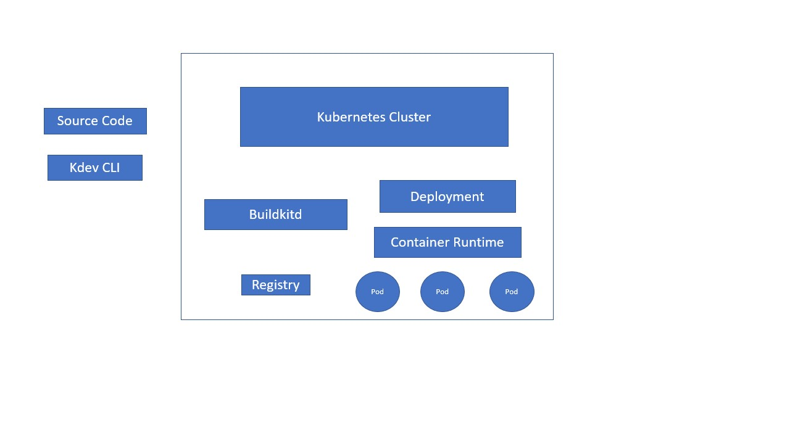

## kdev

Tools to use single-node kubernetes cluster to develop and build applications.

Support:
* [k3s](https://github.com/rancher/k3s)
* [k3d](https://github.com/rancher/k3d)
* minikube
* docker for mac, docker for windows(TODO)

## Building

`go build`


## Running

`./kdev`

### How it works



kdev cli will launch buildkit server in kubernetes cluster to perform build tasks. Once build is done, image is exported to container runtime locally(or you can choose to push to registry). Deployments(pods) will be updated to the latest image that were just built, so you can quick iterate your source code.

### Requirements

You will need to have Dockerfile in your repo.

### Runtime
By default k3s/k3d will work by default with containerd runtime. If you are using minikube, run
```
export CONTAINER_RUNTIME=minikube
```

### Quick start

1. Download the latest release, or build it from source code.
2. Run `./kdev run -p 9000:8080 ./exmaple`

`-p 9000:8080` port-forwards localhost:9000 to container port 8080. By default `kdev run` creates a deployment, but it can be changed to run a pod by adding `kdev run --pod`.

To build an image locally, run
```
# By default image name will be docker.io/namespace(default)/folder_name@$(sha256hash)
kdev build ./example
```

To build and push image, you have to set tag
```
kdev build --tag stringmonkey1992/demo:example --push ./example
```

To build and update existing deployments, supported filter "name=", "label="
```
kdev build --selector "name=foo" ./example

kdev build --selector "label=foo=bar" ./example
```

To apply a build file, run 
```
kdev up -f ./example/.kdev-config
```

Kdev supports the following file format:
```yaml
foo:
  build_context: ./exmaple
  tag: username/image_name:latest
  dockerfile: 
  dockerfile_path:
  push_registry: grc.io
  push: true
  no_cache: true
  target:
    apiVersion: apps/v1
    kind: Deployment
```

It will update image field for deployment foo in namespace default once build is finished

Kdev also supports updating rio service
```yaml
foo:
  build_context: ./exmaple
  target:
    apiVersion: rio.cattle.io/v1
    kind: Service
```

To port-forward an exsiting pod, run
```
kdev pf -p 8080:80 $podname
```


## License
Copyright (c) 2019 [Rancher Labs, Inc.](http://rancher.com)

Licensed under the Apache License, Version 2.0 (the "License");
you may not use this file except in compliance with the License.
You may obtain a copy of the License at

[http://www.apache.org/licenses/LICENSE-2.0](http://www.apache.org/licenses/LICENSE-2.0)

Unless required by applicable law or agreed to in writing, software
distributed under the License is distributed on an "AS IS" BASIS,
WITHOUT WARRANTIES OR CONDITIONS OF ANY KIND, either express or implied.
See the License for the specific language governing permissions and
limitations under the License

### How it works